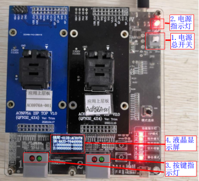

.. _programmer_1to2:

杰理科技一拖二烧写器用户手册
############################

==========  ============    ================
``版本号``  ``修订日期``    ``修订说明``
V1.0        2021-02-25      新建初版
V1.1        2021-04-06      优化部分操作流程
==========  ============    ================
		
.. note::
    诚挚的感谢您使用杰理科技一拖二烧写器！
    正式使用之前，敬请仔细阅读本手册，确保您的正确和安全使用。阅后请妥善保管本手册，以方便他人进一步查阅使用。

    您在使用过程中，如遇到任何解决不了的问题，请随时与本公司的工程师联系，我们将会及时向您提供最有效的服务。

.. _programmer_1to2_1:

1 烧写器简要介绍
**************

1.1 功能描述
===========
杰理科技一拖二烧写器主要用于杰理各系列芯片的程序烧写，可同时实现对2个目标芯片烧写,支持开发过程对目标芯片手动烧录程序，量产配合自动烧录机台对目标芯片自动烧录程序。手动烧录裸片需上层板支持，自动烧录裸片需转接板支持。一拖二烧写器主要有以下功能：

- 烧写功能（芯片程序烧写）
- 校验功能（校验芯片内程序是否与烧写文件一致）
- 查空功能（判断芯片是否是空片）
- 授权烧写次数限制
- 蓝牙地址自增
- 认证码等资源烧写
- 芯片性能测试
- 功能定制

1.2 烧写器清单
==============

.. table:: 烧写器清单
    :widths: 60 60 60
    :align: left

    =============  =====================        ========    
    **模块类型**   **包含部分**                 **说明**
    -------------  ---------------------        --------    
    烧写器主机     主控板                       用于控制烧写器工作
    -------------  ---------------------        --------    
    ..             9V电源供电口	                主供电端口
    -------------  ---------------------        --------    
    ..             电源指示灯                   上电后亮灯
    -------------  ---------------------        --------    
    ..             电源自锁开关	                总电源开启与关闭
    -------------  ---------------------        --------    
    ..             拨码开关	                    用于工作模式设置
    -------------  ---------------------        --------    
    ..             独立按键	                    强制更新烧写器程序或用于工作模式设置
    -------------  ---------------------        --------    
    ..             USB接口                      用于更新烧写器控制程序和目标芯片烧写程序
    -------------  ---------------------        --------    
    ..             调试串口                     烧写器出问题时方便工程师调试
    -------------  ---------------------        --------    
    ..             通道1烧录座接口              接上层板或转接板
    -------------  ---------------------        --------    
    ..             通道2烧录座接口              接上层板或转接板
    -------------  ---------------------        --------    
    ..             通道1开始按键                按开始按键进行手动烧录
    -------------  ---------------------        --------    
    ..             通道2开始按键                按开始按键进行手动烧录
    -------------  ---------------------        --------    
    ..             通道1开始按键指示灯          用于指示烧写状态
    -------------  ---------------------        --------    
    ..             通道2开始按键指示灯          用于指示烧写状态
    -------------  ---------------------        --------    
    ..             工作模式状态指示灯           指示烧写，校验、查空，静音模式
    -------------  ---------------------        --------    
    ..             OLED显示屏                   显示烧录状态信息
    -------------  ---------------------        --------    
    ..             蜂鸣器                       烧录状态声音提示
    -------------  ---------------------        --------    
    上层板         ..                           指手动烧录时放芯片的socket板
    -------------  ---------------------        --------    
    转接板         ..                           自动烧录接转接socket板和自动烧录信号线
    -------------  ---------------------        --------    
    转接socket板   ..                           指自动烧录时放芯片的socket板
    -------------  ---------------------        --------    
    电源适配器     ..                           请使用9.0V、2.0A以上规格电源
    =============  =====================        ========    

1.2烧写器主机介绍
=================

- 不同版本烧写器差异，
  本文档以常用的V3.1硬件版本烧写器和V5.0硬件版本烧写进行介绍，这两个不同的硬件版本的烧写器功能一致，主要差异在于工作模式设置不同，差异如下：

    .. table:: 烧写器清单
        :widths: 60 60 
        :align: left
        =================== =======================
        硬件版本            差异说明
        ------------------- ----------------------
        V3.1                烧写、校验、查空工作模式由拨码开关设置
        ------------------- ----------------------
        V5.0                烧写、校验、查空工作模式由独立按键设置,无拨码开关
        =================== =======================

- V3.1硬件版本烧写器

    .. figure:: img/杰理科技一拖二烧写器用户手册7375.png
       :width: 500px
       :align: center
       :alt: V3.1硬件版本烧写器
    
       图1.1 V3.0主机正面

- V5.0硬件版本烧写器

    .. figure:: img/杰理科技一拖二烧写器用户手册7432.png
       :width: 500px
       :align: center
       :alt: V5.0硬件版本烧写器
    
       图1.2 V5.0主机正面

- 烧写器主机背面实物

    .. figure:: img/杰理科技一拖二烧写器用户手册7491.png
       :width: 500px
       :align: center
       :alt: V5.0硬件版本烧写器
    
       图1.3 主机背面

1.3主控板介绍
=============

#. 不同版本主控板差异，目前主控板有两个硬件版本提供使用，分别为V3.0版本主控板和V5.0版本主控板，两者差异如下：

    =========== ===========================
    硬件版本        差异说明
    V3.0            不带授权烧写次数限制功能
    V5.0            带授权烧写次数限制功能
    =========== ===========================

#. 主控板实物，不同版本主控板实物

    .. figure:: img/杰理科技一拖二烧写器用户手册7664.png
       :width: 500px
       :align: center
       :alt: 不同版本主控板
    
       图1.4 不同版本主控板

1.4 上层板介绍与安装
====================
在手动烧录时需要用到上层板，用于放置待烧写的芯片，与烧写器通信，实现芯片烧写的功能。
上层板安装在烧写器上的实物。

   图1.5 上层板安装

.. important::
    
    烧写器与上层板的接口（上下两排）：上排是 20P，下排是 22P ，而烧写器顶板：上排是 20P, 下排也是 20P ，在盖顶板的时候，下排要靠右，即最左会留空一排针。

1.5 转接板介绍与安装
====================
在机台自动烧录时需要用到转接板连接自动烧录控制信号线，同时用转接板与机烧专用socket座进行连接。
转接板与socket座连接并安装在烧写器上的实物

   图1.6 转换板安装

.. important::
    安装注意事项，同上层板安装一致

1.6 烧写器使用流程说明
======================

   图1.7 烧写器使用流程图

使用流程说明，以下通过表格的方式，对使用流程进行介绍说明。

==========================  =======================================================
**使用流程**                **说明**
烧写器上电开机              烧写器出货前已经烧录有烧写器固件程序，拿到烧写器后即可上电开机
确认或更新烧写器固件        烧写器固件指控制整个烧写器工作的主控芯片固件程序，烧写目标芯片程序前务必确认当前烧写器固件版本是否是最新，不是最新请通过远程升级方式更新最新版本烧写器固件程序（特殊情况除外），否则可能出现一些烧录问题。
确认或更新目标芯片程序      目标芯片程序指fw文件，ufw文件，key文件；需把文件更新到烧写器存起来，烧写时才能把对应数据烧录到目标芯片，或实现校验和查空功能；更新目标芯片程序时还需对烧写配置项进行配置，实现资源烧写、芯片性能测试等功能
确认或设置烧写器工作模式    工作模式指烧写、校验、查空等工作模式；务必确认好烧写器当前的工作模式，以防出现一些烧录问题
手动或自动烧录芯片程序      手动烧录指通过上层板进行手动操作烧写芯片；自动烧录指通过转接板并使用自动烧录机台控制实现自动烧录
==========================  =======================================================

.. _programmer_1to2_2:

2 手动烧写、校验、查空芯片操作流程
*********************************

2.1 烧写器上电开机
=================
- 烧写器供电，烧写器使用9V电源适配器进行供电，电源接线如图所示2.1所示。

   图2.1 烧写器供电接线图

- 烧写器上电开机，烧写器出厂前已烧录有控制烧写器工作的固件程序，拿到烧写器后即可上电开机。烧写器供电后操作步骤如下所示，
 #. 按下“电源总开关”；
 #. 上电后，“电源指示灯”亮起，烧写器蜂鸣器会短叫一声，
 #. 2 路烧录“按键指示灯”红色指示灯和绿色指示灯会短亮；
 #. “液晶显示屏”会亮起；

   图2.2 上电开机画面

2.2烧写器固件版本确认及更新
===========================
烧写器固件指控制整个烧写器工作的主控芯片固件程序，烧写目标芯片程序前务必确认当前烧写器固件版本是否是最新（特殊情况除外），否则可能出现一些烧录问题。

 - 当前烧写器版本确认，烧写器上电开机显示完“杰理LOGO”后，会显示2S时间当前烧写器固件版本号（更新目标芯片程序界面也包含有烧写器固件版本号），如图2.3所示。

    .. figure:: img/杰理科技一拖二烧写器用户手册8998.png
       :width: 300px
       :align: center
       :alt: 烧写器固件版本号显示
    
       图2.3 烧写器固件版本号显示

 - 定期检查是否有新版本及更新烧写器固件，进入远程升级烧写器固件的PC端控制界面，即可获取到最新的3个烧写器固件版本号，可选择需要的版本进行升级。升级步骤可参考《4远程升级烧写器固件》章节内容。

2.3 更新目标芯片程序到烧写器
===========================
- 更新说明，芯片烧写、校验、查空程序前，需要更新目标芯片对应的烧写程序即SDK编译生成的fw文件、ufw文件，或key文件到烧写器，烧写过程烧写器会把程序烧写到目标芯片，或利用程序进行校验和查空。如果烧写器已经更新过对应的程序，请跳过以下小节的操作步骤。

- 打开更新程序界面，在烧写器上电开机后，按如图2.4所示进行操作，

    .. figure:: img/杰理科技一拖二烧写器用户手册9452.png
       :width: 500px
       :align: center
       :alt: 打开更新程序界面
    
       图2.4 打开更新程序界面

  #. 使用USB线进行“烧写器和PC端连接”，显示屏显示“PC模式”；
  #. 打开PC端“此电脑”，看到“CD驱动器”光驱；
  #. 鼠标右键打开“CD驱动器”光驱，会看到 burn_tool.exe 文件；
  #. 双击“burn_tool.exe”，出现如图2.5所示更新程序的界面；

    .. figure:: img/杰理科技一拖二烧写器用户手册9469.png
       :width: 500px
       :align: center
       :alt: 打开更新程序界面
    
       图2.5 打开更新程序界面

- 选择要烧写的目标芯片型号，这里对 **AC897N芯片** 进行fw烧写文件更新演示，所以在打开更新程序界面后，选择要烧写的目标芯片型号时，在如图2.6所示“芯片类型”下拉菜单，选择芯片类型为 **AC897N** 。

    .. figure:: img/杰理科技一拖二烧写器用户手册9596.png
       :width: 500px
       :align: center
       :alt: 芯片型号选择界面
    
       图2.6 芯片型号选择界面

- 选择并更新烧写文件到烧写器让，待烧写的芯片型号选择好后，按如图2.7所示步骤操作：

    .. figure:: img/杰理科技一拖二烧写器用户手册9951.png
       :width: 500px
       :align: center
       :alt: 芯片型号选择界面
    
       图2.7 更新fw烧写文件到烧写器

  #.点击打开并选择fw文件（ufw文件、key文件也可以，也可烧写经过授权后带烧写次数限制的fw/ufw文件，可参考 :ref: `7授权烧写次数限制功能<programmer_1to2_2>` 章节内容）；
  #.点击配置，选择芯片烧写配置项后点击OK，如图2.8所示（一般默认，可参考 :ref:`5各型号芯片PC端烧写配置项介绍<programmer_1to2_5>` 章节内容根据需求进行配置）；
  #.点击更新按钮，更新FW文件即目标芯片烧写程序到烧写器；
  #.更新烧写成功后，有“更新烧写器成功，请重新上电”提示，点击确认后请对烧写器重新上电。

    .. figure:: img/杰理科技一拖二烧写器用户手册9972.png
       :width: 500px
       :align: center
       :alt: 烧写配置项配置界面
    
       图2.8 烧写配置项配置界面

    .. note::
        如果更新失败，有对应的错误信息提示，根据提示找错误原因再重新更新，如反复更新失败，有解决不了的问题，及时联系杰理技术支持。

2.4烧写器工作模式介绍与设置
===========================

.. table:: 烧写器工作模式介绍

    ========    ==========================================================
    工作模式	模式介绍
    烧写模式	对目标芯片进行程序烧写,烧录更新到烧写器的FW文件数据到芯片
    校验模式	校验目标芯片的程序与所更新到烧写器的FW文件数据是否一致
    查空模式	检查芯片是否已经烧写有程序或是否烧写有key文件
    声音模式	打开蜂鸣器声音提示功能
    静音模式	关闭蜂鸣器声音提示功能
    ========    ==========================================================

- V3.1版本烧写器工作模式设置，此版本烧写器主要用拨码开关来设置工作模式，1~5拨码开关作为一个控制单元用来设置烧写、校验、查空模式;第6个拨码开关作为一个控制单元用来设置声音模式。工作模式对应的拨码开关拨码如图2.9所示。

    .. figure:: img/杰理科技一拖二烧写器用户手册10305.png
       :width: 500px
       :align: center
       :alt: 拨码开关设置工作模式
    
       图2.9 拨码开关设置工作模式

- V5.0版本烧写器工作模式设置，
  - 烧写、校验、查空模式设置，如图2.10所示的操作步骤，
    #.长按独立按键 3s后松开，烧写器进入模式设置状态，显示屏显示“模式设置和当前模式”、1 号指示灯不断闪烁；
    #.短按“独立按键”切换烧写器模式（ 烧写-校验-查空循环切换）；
    #.独立按键2s 内未操作后，即选择了当前设置的模式，显示屏回到正常界面（显示屏显示正常界面前有2S显示当前烧写器版本号)，正常界面显示有当前的工作模式。

    .. figure:: img/杰理科技一拖二烧写器用户手册10540.png
       :width: 500px
       :align: center
       :alt: 独立按键设置声音模式
    
       图2.10 独立按键设置工作模式

  - 声音模式设置：如图2.11所示，显示屏处于显示正常界面，短按独立按键切换声音模式（声音模式-静音模式循环切换）。

    .. figure:: img/杰理科技一拖二烧写器用户手册10617.png
       :width: 500px
       :align: center
       :alt: 独立按键设置声音模式
    
       图2.11 独立按键设置声音模式

2.5芯片程序烧写
===============

2.5.1烧写准备工作
（1）烧写芯片程序前，确保执行了2.1~2.4小节的相关操作，以防烧写过程出现一些异常问题，包括：
烧写前上电开机，进入正常显示界面（2.1小节）
确认或更新当前烧写器固件版本为需要的版本（2.2小节，可不定时确认）
确认或更新当前烧写器内的目标芯片程序为要烧写的程序（2.3小节）
确认或设置当前烧写器工作模式为烧写模式（2.4小节）
（2）安装好上层板后，放置芯片到对应芯片型号的上层板socket座子上，芯片放好后盖上socket座盖子。芯片放置如图2.12所示。

图2.12 芯片放置
    注：上层板socket座上白色的小箭头为芯片第1引脚，请别放错。
2.5.2芯片开始烧写
烧写准备工作做好后，即可对芯片执行烧写。如果芯片放置在通道1上层板上进行烧写，请短按通道1开始按键；如芯片放置在通道2上层板上进行烧写，请短按通道2开始按键；如图2.13所示。
                            图2.13 芯片开始烧写操作

2.5.3烧写结果判断
（1）烧写成功判断
    烧写成功后显示屏成功计数部分加1，开始按键短按后绿色指示灯由“灭-亮-灭”变化，蜂鸣器鸣叫一声，表示烧写成功。例如通道1烧写成功显示屏显示变化如图2.14所示。
                             图2.14 通道1烧写成功显示变化
（2）烧写失败判断
开始按键短按后绿色指示灯由“灭-亮-灭”变化后，红色指示灯亮起，并在显示屏上显示错误信息。例如通道1开始烧写后报通信失败（也可能是其它错误类型），如图2.15所示。显示屏报错后，下次烧写成功，或者重启烧写器显示即可恢复正常。
图2.15 通道1烧写失败显示
    注：了解详细的状态指示和报错提示说明，请参考《6状态指示和报错提示说明》章节。
2.6芯片程序校验
2.6.1校验准备工作
（1）校验芯片程序前，确保执行了2.1~2.4小节的相关操作，以防校验过程出现一些异常问题，包括：
校验前上电开机，进入正常显示界面（2.1小节）
确认或更新当前烧写器固件版本为需要的版本（2.2小节，可不定时确认）
确认或更新当前烧写器内的目标芯片程序为要校验的程序（2.3小节）
确认或设置当前烧写器工作模式为校验模式（2.4小节）
（2）安装好上层板后，放置芯片到对应芯片型号的上层板socket座子上，芯片放好后盖上socket座盖子。
2.6.2芯片开始校验
校验准备工作做好后，即可对芯片执行校验。如果芯片放置在通道1上层板上进行校验，请短按通道1开始按键；如芯片放置在通道2上层板上进行校验，请短按通道2开始按键；操作步骤同《2.5.2芯片开始烧写》小节一致。
2.6.3校验结果判断
（1）校验成功判断
    校验成功后显示屏成功计数部分加1，开始按键短按后绿色指示灯由“灭-亮-灭”变化，蜂鸣器鸣叫一声，表示校验成功。校验成功显示屏显示变化同烧写成功显示屏变化一致。          
（2）校验失败判断
开始按键短按后绿色指示灯由“灭-亮-灭”变化后，红色指示灯亮起，并在显示屏上显示错误信息。例如通道1开始校验后报校验失败（也可能是其它错误类型），如图2.16所示。显示屏报错后，下次校验成功，或者重启烧写器显示即可恢复正常。
图2.16 通道1校验失败显示
2.7芯片程序查空
2.7.1查空准备工作
（1）查空芯片程序前，确保执行了2.1~2.4小节的相关操作，以防查空过程出现一些异常问题，包括：
查空前上电开机，进入正常显示界面（2.1小节）
确认或更新当前烧写器固件版本为需要的版本（2.2小节，可不定时确认）
确认或更新当前烧写器内的目标芯片程序为要查空芯片的程序（2.3小节）
确认或设置当前烧写器工作模式为查空模式（2.4小节）
（2）安装好上层板后，放置芯片到对应芯片型号的上层板socket座子上，芯片放好后盖上socket座盖子。
2.7.2芯片开始查空
查空准备工作做好后，即可对芯片执行查空。如果芯片放置在通道1上层板上进行查空，请短按通道1开始按键；如芯片放置在通道2上层板上进行查空，请短按通道2开始按键；操作步骤同《2.5.2芯片开始烧写》小节一致。
2.7.3查空结果判断
（1）查空成功判断
    查空成功后显示屏成功计数部分加1，开始按键短按后绿色指示灯由“灭-亮-灭”变化，蜂鸣器鸣叫一声，表示查空成功。查空成功显示屏显示变化同烧写成功显示屏变化一致。          
（2）非空片判断
开始按键短按后绿色指示灯由“灭-亮-灭”变化后，红色指示灯亮起，并在显示屏上显示芯片已烧程序的CRC16校验码或错误信息。例如通道1开始查空后显示屏显示校验码（也可能是其它错误类型），如图2.17所示。显示屏校验码或报错后，下次查空成功，或者重启烧写器显示即可恢复正常。
图2.17 通道1查空显示程序校验码

3机台自动烧写操作流程
3.1机台自动烧写说明
（1）目的
    人工烧写速度慢，机台自动烧写可以大大提高烧录速度，解决人工烧写效率低问题。
（2）实现说明
    机台控制烧写器自动烧录有两种实现方法，分别是通过IO信号控制烧录和通过串口命令控制烧录。通常都是通过IO信号控制自动烧录，后面介绍的是通过IO信号控制烧录的接线。如有通过串口控制烧录需求，请联系杰理公司，将向你提供串口控制命令和实现方法。
    机台主要是通过烧写器上的IO信号控制自动烧写，取代手动烧录中“开始烧写”和“烧写结果判断”两个步骤中的相关工作。通过机器手放芯片到转接socket座上并执行开始烧写，机台实时监控IO信号对应的烧写状态，对烧写结果进行判断处理。
3.2自动烧写IO控制信号说明
机台自动烧录信号控制线，接转接板的“自动烧录IO控制信号线”，请参考《1.5 转接板介绍与安装》小节图1.6。烧写器有两个通道的控制信号线，单个通道信号线有Start信号线，Busy忙信号线，Ok信号线，控制信号线说明如一下表格所示。

编号	类型	Start（开始按键）	Busy（绿灯）	Ok（红灯）
1	信号说明	机台供给烧写器	烧写器输出给机台	烧写器输出给机台
2	初始状态	高电平	高电平（绿灯灭）	高电平（红灯灭）
3	开始烧写	低电平（10ms左右）	/	/
4	正在烧录	/	低电平（绿灯亮）	高电平（红灯灭）
5	烧录成功	/	高电平（绿灯灭）	高电平（红灯灭）
6	烧录失败	/	高电平（绿灯灭）	低电平（红灯亮）
3.3样机芯片自动烧写
3.3.1自动烧写准备工作
（1）自动烧写芯片程序前，确保执行了2.1~2.4小节的相关操作，以防烧写过程出现一些异常问题，包括：
烧写前上电开机，进入准备正常显示界面（2.1小节）
确认或更新当前烧写器固件版本为需要的版本（2.2小节，可不定时确认）
确认或更新当前烧写器内的目标芯片程序为要烧写的程序（2.3小节）
确认或设置当前烧写器工作模式为烧写模式（2.4小节）
（2）自动烧录机台烧写环境搭建。
3.3.2自动烧写流程
自动烧写准备工作做好后，即可对芯片执行自动烧写。机台自动烧写流程大致如图3.1所示：

图3.1自动烧写流程

4远程升级烧写器固件
4.1升级说明
一拖二烧写器固件是指控制整个烧写器工作的主控芯片固件程序。烧写器固件远程升级需要用到远程升级工具“一拖二烧写器远程升级工具.exe”（工具杰理公司提供）,升级工具可选择最新的3个版本固件进行升级，同时支持升级根据客户需要制作的特殊版本烧写器固件。
烧写器固件会根据实际情况不定时进行优化升级，正常情况下务必及时升级到最新版本，否则可能出现一些烧录问题。
4.2远程升级烧写器固件流程
（1）如图4.1所示，【1】烧写器上电（也可不上电直接连接USB线）；【2】 使用 USB 线进行“烧写器和 PC 端连接”，显示屏显示“PC 模式”；

图4.1 进入PC模式说明
（2）双击如图4.2所示可执行文件“一拖二烧写器远程升级工具.exe”，打开远程升级工具控制界面如图4.3所示。

图4.2 远程升级工具可执行文件

图4.3 远程升级工具控制界面
（3）如图4.4所示，【1】选择要升级的烧写器固件版本，【2】点击“升级”（点击后出现一个温馨提示框，点击“yes”就好）；【3】升级成功后，对烧写器重新上电；

图4.4 远程升级操作说明

4.3特殊版本升级流程
（1）烧写器上电后使用USB线进行“烧写器和PC端连接”（也可不上电直接连接USB线），让烧写器进入“PC模式”；
（2）双击可执行文件“一拖二烧写器远程升级工具.exe”，打开远程升级工具控制界面。
（3）如图4.5所示，【1】输入要升级的特殊版本序列号；【2】点击查询；【3】点击升级（点击后出现一个温馨提示框，点击“yes”就好）；【4】升级成功后，对烧写器重新上电；

图4.5 远程升级特殊版本操作说明
4.4升级异常处理
（1）升级过程出现USB松动等原因导致升级失败，请对烧写器重新上电再插入USB线，重新走正常的升级流程；
（2）远程升级工具如果一直未检测到烧写器插入，可以尝试：【1】烧写器不供电，按住烧写器上的“独立按键”；【2】烧写器插入USB线并连接PC；【3】松开独立按键；这时远程升级工具一般能再次检测到烧写器插入，这时候走正常的升级流程即可；

5各型号芯片PC端烧写配置项介绍
5.1打开并选择配置项
更新fw烧写文件时，PC端更新程序界面有一个“配置”控件，点击“配置”控件，出现很多可选的或需要配置的配置项，正常情况下默认就好，但也可以根据客户需要进行选择。例如打开V2.23.7版本更新AC897N芯片程序的配置界面，可看到的配置项有DAC、IQ_TRIM、LNA、免晶振方案（LRC_TRIM）、强制更新认证码，PA、REF_TRIM、LVD、蓝牙配置，如图5.1所示。加载目标芯片程序fw文件后对各配置项进行配置，点击更新即可更新目标芯片程序和配置信息到烧写器。
图5.1 芯片烧写配置界面
注：不同版本烧写器固件的配置界面可能不一致，请及时更新到最新的烧写器固件。
5.2各型号芯片常用配置项介绍
不同型号芯片的烧写配置项基本相同，不同芯片的配置项名字一致其实际作用也相同。以下通过表格的形式对各个系列芯片的一些常用配置项进行介绍说明，烧写时可根据实际需要进行配置。

编号	配置项	配置项说明
1	DAC	勾选，进行音频DAC模块性能测试用于筛选DAC相关参数不达标的芯片
2	IQ_TRIM	勾选，进行蓝牙相关校准参数测试
3	LNA	勾选，进行蓝牙接收性能测试用于筛选出蓝牙接收参数不达标的芯片
4	PA	勾选，进行蓝牙发送性能测试用于筛选蓝牙发送参数不达标的芯片
5	REF_TRIM	勾选，进行芯片的ADC基准源校准
6	免晶振方案（LRC_TRIM）	勾选，对无需外挂晶振的芯片进行LRC时钟校准
7	LVD电压	配置芯片低电复位的电压值，二次烧写要配置成相同值否则报错不能继续烧写，选择时请结合实际方案和SDK说明进行配置LVD电压
8	强制更新认证码	勾选，非空片烧录时候如芯片内原来已烧写有认证码数据将会被覆盖再烧写一个新的认证码，一般默认不勾选如芯片已有认证码则使用已有的避免浪费认证码
9	蓝牙地址	勾选，配置输入蓝牙地址范围，同时勾选自增，烧写芯片时蓝牙地址按照递增的形式烧写到每颗芯片中去；也可以勾选随机，烧写随机地址到芯片
10	SFC校验	根据开发方案选择音箱方案或其他方案，烧写时在所选方案使用的电压测试条件进行SFC模式下的程序数据校验，用于筛选程序数据校验不过的芯片
11	电池方案	根据芯片使用的电池类型对应工作电压，配置芯片低电复位的LVD电压值；可选择锂电池（3.0V~4.4V），对应的LVD电压2.3V;两节干电池（1.8V~3.2V）,不使能LVD低电复位功能；纽扣电池（2.2V~3.6V），对应的LVD电压1.8V;（配置的值烧写为OTP一次性烧写，选择一个方案烧写后不能选择其他方案再次烧写，请慎重选择）
12	LOOP_BACK	勾选，进行蓝牙性能相关的参数测试，用于筛选参数不达标的芯片
13	AC95N/AC96N烧写选项	线性充电电流档位（mA）:根据设计方案配置线性充电电流档位；
开关充电电流档位（mA）:根据设计方案配置线性充电电流档位；
VOUT(mV):升压模块需要调整到的VOUT电压值；
VBAT(V):根据使用的电池类型选择4.2V或者4.35V
模拟再校准：开启（选择on）,可以重新配置线性开关充电电流档位和修改VOUT、VBAT参数再烧写；
功能测试：开启（选择on），进行芯片低功耗测试，筛选功耗不达标的芯片

14	使能（引脚）短按复位功能	勾选，烧写相应配置值到芯片，使能芯片的短按复位功能 
15	使能（引脚）长按复位功能	勾选，烧写相应配置值到芯片，将使能芯片的长按复位功能 

6状态指示和报错提示说明
6.1 led指示灯说明
6.1.1电源指示灯
    按下电源自锁开关，电源指示灯红灯亮起。电源指示灯如图6.1所示。

图6.1电源指示灯
6.1.2工作模式指示灯
（1）工作模式指示灯如图6.2所示。

图6.2工作模式指示灯
（2）工作模式指示灯状态说明
 
编号	工作模式	LED1	LED2	LED3	LED4	LED5	LED6
1	烧写模式	亮	亮	亮	灭	灭	/
2	校验模式	亮	灭	亮	灭	灭	/
3	查空模式	亮	灭	灭	亮	灭	/
4	声音模式	/	/	/	/	/	亮
5	静音模式	/	/	/	/	/	灭
6.1.3开始按键指示灯
（1）开始按键指示灯如6.3所示

图6.3开始按键指示灯
（2）开始按键指示灯状态说明

编号	烧写状态	绿灯	红灯
1	正常状态	灭	灭
2	正在烧录	亮	灭
3	烧录成功	灭	灭
4	烧录失败	灭	亮

6.2蜂鸣器提示音说明
编号	情景	提示音类型	提示音说明
1	上电开机	短叫1声	烧写器上电开机正常
2	上电开机	叫2声以上	上电开机异常，结合显示屏信息了解报错情况
3	烧录过程	短叫1声	烧写完成，提示烧录成功
4	烧录过程	叫2声及以上	烧录异常，结合显示屏信息了解报错情况

6.3 OLED显示说明
6.3.1上电开机显示
   显示杰理，再显示2S烧写版本信息，后进入正常界面显示，如图6.4所示。

图6.4上电开机显示
6.3.2正常界面介绍
    显示屏正常界面显示如图6.4所示。

图6.4工作显示界面介绍
    注：工作模式只有V5.0版本才显示。
6.3.3烧录成功显示
    对应的通道显示屏成功计数部分加1（如图6.4通道1烧写成功次数部分）。
6.3.4烧录失败显示
（1）显示屏显示的错误提示类型格式
     通道：E错误号-中文提示
     例如：1：E02-通信失败
（2）显示屏错误显示
    举例：如通道1报操作超时,通道2报通信失败，显示如图6.5所示。

图6.5 错误提示显示
6.3.5升级模式显示
升级烧写器程序或更新目标芯片程序，烧写器插入USB连接PC后，出现如图6.6所示显示。

图4.5 进入升级模式显示
6.3.6模式设置显示
    V5.0版本烧写器，长按3s独立按键后进入模式设置显示，后短按按键（烧写-校验-查空）循环切换，显示如图6.6所示。

图6.6模式设置显示
6.4 OLED报错提示说明
以下通过表格的形式对显示屏报错提示进行说明。
编号	错误提示类型	错误提示说明
1	E02-通信失败	烧写器与目标芯片通信不上，可能原因：无芯片，芯片放置不好，放错芯片情况
2	E03-校验失败	需校验的程序与目标芯片程序不一致，或程序烧写到芯片的数据出错，导致烧写完后对程序数据校验不通过
3	E04-KEY 不对	空片烧写，key烧写到目标芯片失败，key烧录不良；二次烧录，芯片KEY与待烧的FW程序KEY不一致，或首次烧写不良导致二次烧录不匹配。
4	E05-文件失败	烧写器获取烧写程序文件失败
5	E06-识别失败	目标芯片无法识别、出现在芯片放置不稳等情况
6	E07-芯片异常	目标芯片工作不正常，可能是接触不好，或者是坏片
7	E08-烧写失败 	目标芯片判读写入失败
8	E09-操作超时	目标芯片烧写超时，可能原因：芯片时钟异常，串口通信异常等情况
9	E10-校准异常	目标芯片校准参数不达标，不在正常范围内
10	E11-RX失败	蓝牙接收模块性能测试，测出来的电流参数不在规定范围内
11	E12-TX失败	蓝牙发送模块性能测试，测出来的电流参数不在规定范围内
12	E13-FM失败	芯片FM性能测试，测出来的电流参数不在规定范围内
13	E14-IQ失败	进行蓝牙相关校准参数测试，参数不在指定的范围内
14	E15-容量不对	fw烧写程序文件数据容量大于Flash容量
15	E16-SFC失败	SFC模式下程序数据校验不过
16	E17-VPP异常	开机上电，烧写器输出给上层板或者转接板6.5V电压偏差太大
17	E18-电流异常	目标芯片工作电流超出设定值
18	E19-功能错误	样机芯片开始烧写，校验，查空时报此此错误，为设置的模式非烧写，校验，查空三种工作模式，或拨码开关接触不良导致烧写器检测出错。
19	E21-版本不对	待烧写的FW文件程序与芯片的版本不匹配，需确认fw文件对应的SDK是否支持该版本的芯片，如有不清楚请联系杰理技术支持
20	E26-重烧失败	蓝牙地址，认证码等数据覆盖烧写失败
21	E28-查空失败	目标芯片查空失败，芯片非空片
22	E29-配置错误	与PC端相关的配置项配置出错，一般为芯片校准参数不达标
23	E30-ADC错误	烧写器的 ADC测电流模块 工作不正常
24	E31-内存错误	烧写器的 EEPROM 工作不正常
25	E33-芯片异常	目标芯片工作不正常，可能是接触不好，或者是坏片
26	E34-LVD错误	LVD设置的档位与目标芯片已经烧写的LVD档位不匹配
27	E35-串口异常	烧写器与目标芯片的串口通信失败
28	E36-同步失败	烧写文件同步到目标芯片失败
29	E37-读ID失败	读取目标芯片的ID失败，可能原因：芯片异常或烧写器程序有bug
30	E48-UID错误	读取目标芯片UID失败，可能原因：芯片异常或烧写器程序有bug
31	E49-查空溢出	查空次数已经用完，避免量产烧写时误拨到查空模式
32	E50-OSC溢出	OSC参数值超出设定的范围值
33	E51-证书耗尽	认证码已经用完
32	E53- 读取失败	读取文件数据读错或读不到
35	E54- 运行失败	运行目标芯片程序失败,可能原因：烧写器底板不支持授权次数功能
36	E55-匹配失败 	授权次数机器码匹配失败，可能原因：授权发fw文件信息与烧写器对不上
37	E56-更新失败	记录烧写次数失败：可能原因：授权硬件模块异常
38	E57-次数溢出	授权次数已经用完
39	无烧写文件	烧写器未更新有目标芯片的程序，可能原因：第一次更新烧写器程序或目标芯片程序被擦除，或不匹配
40	无sync程序	无同步到目标芯片运行的程序，可能原因：烧写器固件版本出错

7授权烧写次数限制功能
7.1应用场景
比如开发出来的目标芯片程序fw烧写文件，只允许指定烧写器烧写到1000颗芯片上，烧完1000次后，此烧写文件作废，将不能再通过烧写器进行烧写，防止他人谋利。要实现这个功能，可以将fw文件进行授权烧写次数限制。
7.2授权模式介绍
Fw/ufw文件支持两种授权模式：无限制模式和绑定机器码模式。
（1）无限制模式
此模式授权后的 FW/UFW 文件可以被任意KEY匹配的一拖二烧写器加载烧写，同不经过授权的fw/ufw无任何差别。
（2）绑定机器码模式
此模式授权后的 FW/UFW 文件只能被绑定的机器码所属的烧写器加载烧写。
7.3无限制模式授权fw文件制作
PC端双击打开“固件文件烧写授权工具_（版本号）.exe”可执行文件(此工具杰理公司提供)工具面，按照如图7.1所示的1~4步骤操作后，出现如图7.2所示的界面，点击保存授权后的fw文件到指定目录。

图7.1 无限制授权fw文件生成

图7.2 无限制授权fw文件保存
点击保存后，如图7.3所示提示保存成功和保存在的具体路径，点击ok即可。

图7.3 保存授权fw文件提示信息
7.4绑定机器码模式授权
7.4.1制作限制烧写次数fw文件
(1)机器码生成步骤
    【1】PC端打开更新程序界面（如不懂请参考《2.3.2打开更新程序界面》小节内容；【2】如图7.4所示选择界面菜单栏“授权(A)”->“机器码(M)”，打开机器码生成界面；【3】如图7.5所示，点击“更新机器码”，复制生成的机器码到授权工具对fw文件进行授权。

图7.4 打开机器码界面

图7.5 机器码生成界面
注：一个烧写器支持八个机器码生成，可制作8个授权次数限制的fw文件，当前只列举序号1的机器码进行fw文件授权，其它序号的机器码生成，fw授权文件制作流程一致。
（2）生成机器码授权的fw文件
    【1】PC端双击打开“固件文件烧写授权工具_（版本号）.exe”可执行文件工具界面；【2】按如图7.6所示1~6步骤操作，出现如图7.7所示保存界面，点击保存授权后的fw文件到指定目录；【3】点击保存后，如图7.8所示提示保存成功和保存在的具体路径，点击ok即可。
图7.6 机器码授权fw文件生成

图7.7 机器码授权fw文件保存界面

图7.8 保存授权fw文件提示信息
7.4.2制作不限制烧写次数fw文件
    制作不限制烧写次数fw文件，同制作限制烧写次数fw文件步骤基本一致，唯一不同的是不限制烧写次数fw文件制作勾选的是“无限制”，如图7.9所示。配置完后点击“授权”生成对应的授权文件。

图7.9 机器码无限制授权fw文件生成界面
7.5授权次数限制程序烧写说明
（1）已授权的FW文件烧写
    如制作了限制1000次的fw烧写文件jl_isd_AC897N_[已授权-机器码CRC[1603]].fw，参考《2.3更新目标芯片程序到烧写器》小节，把该fw文件更新到烧写器。更新完已授权的fw文件到烧写器后，走正常的芯片烧写流程，烧写成功1000颗芯片后，烧写器将不再支持该FW文件烧写，显示屏报“次数溢出”。
（1）查看授权次数使用情况
    中途想查看授权次数使用情况，可进行【1】PC端打开更新程序界面（如不懂请参考《2.3.2打开更新程序界面》小节内容；【2】选择更新目标芯片程序界面菜单栏“授权(A)”->“机器码(M)”，打开如图7.10所示的机器码控制界面；找到fw文件对应的机器码校验码序号，查看剩余次数。
图7.10 查看授权次数使用情况界面
（2）中途更换烧写程序
中途更换烧写程序，不会造成当前fw授权次数信息掉失，下次可以更新回当前授权的FW继续使用。只有更新其它程序后，重新更新当前序号的机器码，当前序号原有授权信息才作废。
7.6注意事项
（1）一拖二烧写器授权次数限制功能，必须更换V5.0硬件版本的主控板方能使用。详情请查看《1.3主控板介绍》小节，来识别当前主控板是否支持授权次数限制功能。
（2）请保护好未授权的fw文件，不乱转发他人，否则本次授权烧写次数限制无任何意义。

8第三方数据（认证码）烧写功能
8.1应用场景
在SDK开发开发过程中，需要用到第三方的数据，如认证码（序列号，三元组），可在烧写目标芯片程序过程中，同时将第三方数据烧写到目标芯片指定位置,既可以实现在SDK开发中对烧写到芯片内第三方数据的利用。
8.2认证码数据准备
（1）准备要烧写的数据
    如图8.1所示，将认证码数据在记事本中按一行一值的编辑格式进行编辑。编辑好数据后将文件保存为“.csv”文件（逗号分隔值文件格式文件）。

图8.1 认证码数据编辑格式

（2）待烧写的数据格式转换
    待烧写的数据需要进行格式转换，才能被烧写器识别并烧写到目标芯片。把待转换的数据和转换工具“license_to_auth_csv.exe”放到同一目录，点击“license_to_auth_csv.exe”，最终生成烧写器可识别的数据文件，如图8.2和图8.3所示。

图8.2 认证码数据格式转换

  

图8.3 认证码转换后的数据格式
8.3认证码数据烧写流程
8.3.1制作支持认证码烧写的fw文件
    认证码烧写需要对应的fw烧写文件支持才能实现烧写，制作支持认证码烧写的fw文件分实现步骤如图8.4所示：【1】 打开SDK工程的下载目录下的isd_config.ini文件，【2】增加“AUTH_CODE=1；”配置项后保存文件；【3】点击下载目录下的“download.bat”脚本；【4】重新生成可以支持认证码烧写的jl_isd.fw文件。

图8.4 支持认证码烧写的fw文件制作
8.3.2更新fw烧写程序和认证码文件到烧写器
使用USB线进行PC和烧写器连接，烧写器进入“PC模式”后，PC端打开“更新烧写程序控制界面”（如不懂请参考《2.3.2打开更新目标程序界面》小节，了解具体的打开流程）。具体操作步骤如图8.5~8.8所示，【1】打开并选择支持认证码烧写的fw文件；【2】点击OK（取消的话仅更新fw文件到烧写器）；【3】点击OK后选择并打开认证码数据文件；【4】点击配置，选择是否强制更新认证码后点击OK（勾选，如芯片已烧有认证码会覆盖烧写，避免浪费一般不勾选）【5】点击“更新”，更新成功后有更新成功提示，并显示有认证码信息；【6】更新完毕对烧写器重新上电；

图8.5打开并选择支持认证码烧写的fw文件

图8.6打开并选择认证码数据文件

图8.7 配置是否勾选强制更新

图8.8更新fw文件和认证码文件到烧写器
8.3.3 认证码数据烧写到芯片
（1）认证码烧写是按认证码数据文件可用序号递增的形式进行烧写，也就是认证码具有唯一性，烧到每个芯片的认证码都不同。
（2）在烧写芯片程序的同时，烧写器会把认证码数据也烧写到目标芯片，因此烧录流程同单一fw文件烧写流程是一致的。
8.4导出认证码
（1）查看认证码烧写情况导出
使用USB线进行PC和烧写器连接，烧写器进入“PC模式”后，PC端打开“更新烧写程序控制界面”。如图8.9所示，导出认证码信息并保存到指定位置。

图8.9 导出认证码信息

打开导出的认证码文件，如图8.10所示，已经使用过的认证码，对应的位置标识有“TRUE”表示认证码已被使用过。

图8.10 认证码使用情况
（2）更新烧写文件时导出
如果在认证码未使用完时更新烧写文件， 为了避免认证码丢失会提示还有未使用完的认证码。如图8.11和图8.12，点击OK按钮后会弹框要求保存认证码文件，可把认证码文件保存起来方便后续使用（如果不保存，那么将无法更新烧写文件）。

                   
                      
图8.11 更新烧写文件时导出认证码

图8.12 导出认证码到指定位置
8.5注意事项
（1）认证码数据需要使用csv文件方式导入，建议认证码最大长度不超过127bytes。
（2）每台烧写器导入认证码时，请导入合理数量的认证码，并且烧写完所有认证码后再更新烧写文件。
（3）如果确实需要在认证码未烧录完时更换烧写文件，请自行管理好导出的认证码文件。当再次需要烧录之前未烧录完的认证码，为了避免认证码重复烧写或者丢失，请仔细检查导入的认证码文件。

9蓝牙地址自增功能
9.1应用场景
    同一批芯片蓝牙产品，实现每颗芯片对应的蓝牙地址都在规定的地址范围内，且每颗芯片的蓝牙地址都是唯一的。要实现这个功能可在更新fw烧写程序时，在PC端的烧写配置项中配置好对应的蓝牙地址范围，烧写目标芯片程序过程中同时将蓝牙地址按照递增的形式烧写到每颗芯片指定位置，既可以实现在SDK开发中对烧写到芯片内蓝牙地址的利用。与此同时，在SDK开发中可将蓝牙地址按照指定的格式添加到蓝牙名上，可实现蓝牙名的唯一性。
9.2蓝牙地址自增配置
在更新fw文件烧写程序的界面，打开并选择要烧写的目标芯片fw文件程序后，如图9.1所示【1】点击配置；【2】勾选蓝牙地址（不勾选，SDK使用的是随机分配的蓝牙地址）；【3】勾选自增（如勾选随机是随机生成一个蓝牙地址）；【4】输入蓝牙地址自增的范围；【5】点击确认后，再点击更新，更新fw文件和配置信息到烧写器；

图9.1蓝牙地址自增配置

9.3蓝牙地址烧写到目标芯片
（1）蓝牙地址烧写是按照烧写配置项中配置的地址范围，从最低地址开始递增的形式进行烧写，在烧写芯片程序的同时，烧写器会把蓝牙地址也烧写到目标芯。
（2）如设定蓝牙地址范围为：00: 00 : 00 :00 : 00 : 01-  00: 00 : 00 : FF : FF : FF，第1颗芯片烧录成功后的蓝牙地址是00: 00 : 00 :00 : 00 : 01，第2颗芯片烧录成功后的蓝牙地址是00: 00 : 00 :00 : 00 : 02，依次类推。烧录完所设置的范围内的地址后，烧写器会报地址溢出，不能再进行程序烧录。蓝牙地址具有唯一性，烧到每个芯片的蓝牙地址都不同。
9.4注意事项
    PC端烧写配置项中所设定的蓝牙地址范围，在未使用完的情况下更新其他的目标芯片程序，所剩余的蓝牙地址将作废。请务必合理使用，避免不必要的的浪费。

10样机芯片烧写测试和校准接线
10.1应用场景
（1）想对样机芯片进行程序烧写的同时进行性能测试，如dac测试。
（2）需要对样机芯片进行校准，如前期的芯片，或者开发板、DEMO板芯片。
10.2样机芯片烧写测试接线
    此类接线不能对芯片进行校准，只能进行烧写同时对芯片性能进行测试。接线如图10.1所示，接好线后走正常烧写流程即可实现程序烧写。

                       图10.1 只烧样机程序接线
10.3样机芯片校准接线	
此种接线方式可对样机、DEMO板、开发板上的芯片进行烧写测试，也可对芯片进行校准。简便的方法是找一个SOP封装的上层板(容易引线)，引出socket座上的LDOIN、DM、DP、GND,PB1（2.5V基准源，其它部分芯片，上层板的2.5V基准源并不一定是接PB1，视情况而定。）,接到样机芯片对应引脚上，如图10.2所示。走正常烧写流程即可实现芯片校准、程序烧写。

                 

图10.2校准样机芯片接线
11常见错误处理
    以下通过表格的形式，列举一拖二烧写器使用过程中出现的常见错误以及处理办法。

编号	常见错误	处理办法
1	反复更新目标芯片程序、远程升级烧写器固件报错	参考相应章节内容，按正确步骤进操作，如还不行请记录报错信息，及时咨询杰理技术支持
2	上电开机，芯片烧写过程的显示屏报错	参考《6.4 OLED报错提示说明》章节内容，根据说明进行相关处理
3	量产烧写不良率过高	记录烧写不良报错类型，并详细描述操作流程，走相应流程把烧录不良的芯片寄给杰理让工程师进一步分析。
4	芯片烧录成功后不能开机	1.可能烧写时使用的是查空模式，或其它原因导致芯片程序未烧录成功，可以使用校验模式检验芯片程序是否完整
2.芯片本身原因，或SDK问题，需要详细描述生产流程，走相应流程把不良的芯片寄给杰理让工程师进一步分析；

